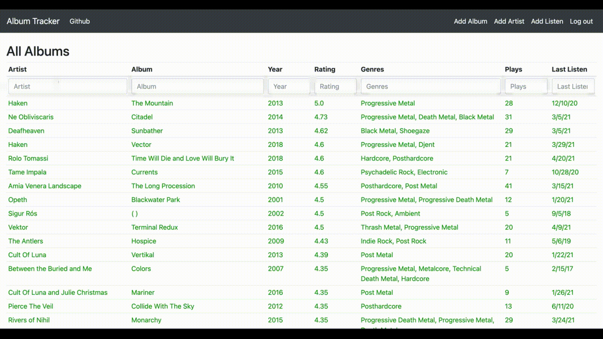

# Music Tracker

This project is a Django-based web application for keeping track of albums I
listen to.

Whenever I listen to a album, I log it in this application, and add it to the
database if it's the first time I've listened to it. The application is being
developed to replace a bloated Excel spreadsheet I've been using for years for
this purpose.

## Features

### Single-column filtering

Text-based filtering including logical and (","), logical or ("|"), and logical not ("!") operators.

### Multi-column filtering

Filter on multiple columns at once, and use numerical comparison operators for numerical and date fields.

### Adding new artists, albums, and album listens

### Open in YouTube

One-click link for searching for an album on YouTube.

